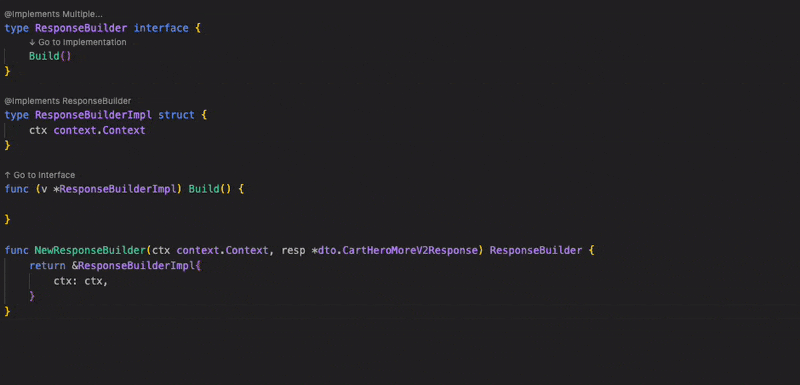

# Go Interface Navigator

A VS Code extension that provides intelligent navigation between interface declarations and their implementations using CodeLens.

## Demo



## Features

- Shows CodeLens indicators next to interface methods and their implementations
- Two-way navigation:
  - Down arrow (↓) next to interface method declarations to navigate to implementations
  - Up arrow (↑) next to method implementations to navigate to their interface declarations
- Works with Go files
- Updates in real-time as you edit your code
- Provides visual feedback when no implementation is found

## Installation

### From VS Code Marketplace
Search for "Go Interface Navigator" in the VS Code Extensions marketplace and install it directly.

### From Source
1. Clone this repository
2. Run `npm install` to install dependencies
3. Run `npm run compile` to compile the extension
4. Press F5 in VS Code to start debugging and test the extension

### From VSIX File
1. Download the latest `.vsix` file from [GitHub Releases](https://github.com/svvashishtha/Go-interface-navigator/releases)
2. In VS Code, go to Extensions (Ctrl+Shift+X)
3. Click the "..." menu and select "Install from VSIX..."
4. Select the downloaded `.vsix` file

## Usage

1. Open a Go file containing interfaces and their implementations
2. You'll see two types of CodeLens indicators:
   - ↓ "Go to Implementation" next to interface method declarations
   - ↑ "Go to Interface" next to method implementations
3. Click on either indicator to navigate between interface and implementation
4. If no implementation is found, you'll see an information message

## Requirements

- VS Code 1.60.0 or higher
- Go files

## Extension Settings

This extension contributes the following settings:

* `go-interface-navigator.enable`: Enable/disable the extension
* `go-interface-navigator.arrowColor`: Customize the arrow color (default: #007acc)

## Development & Publishing

### Building the Extension
To build and package the extension:
```bash
./package-extension.sh
```

### Validating Release
Before publishing, validate your release setup:
```bash
./validate-release.sh
```

### Publishing
The extension is automatically published via GitHub Actions when:
- Pushing to the main branch (if a matching VSIX file exists)
- Creating version tags (e.g., `v0.1.8`)
- Manually triggering the workflow

For manual publishing:
```bash
vsce publish --packagePath go-interface-navigator-{version}.vsix
```

See [`.github/README.md`](.github/README.md) for detailed GitHub Actions setup and troubleshooting.

## Release Notes

### 0.1.7
- Added cross-file interface search functionality

### 0.1.6
- Added a demo gif

### 0.1.4

Initial release of Method Navigator:
- CodeLens-based navigation between interfaces and implementations
- Two-way navigation support (interface to implementation and vice versa)
- Support for Go files
- Visual feedback for missing implementations

## License

This project is licensed under the MIT License - see the [LICENSE](LICENSE) file for details. 


## TODO
- Add a step in GitHub Actions to publish it to the OpenVSX registry as well.